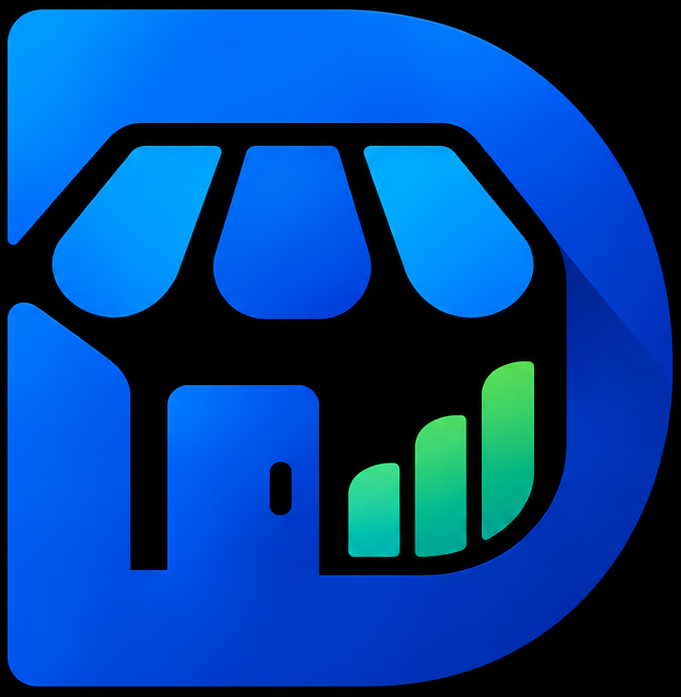
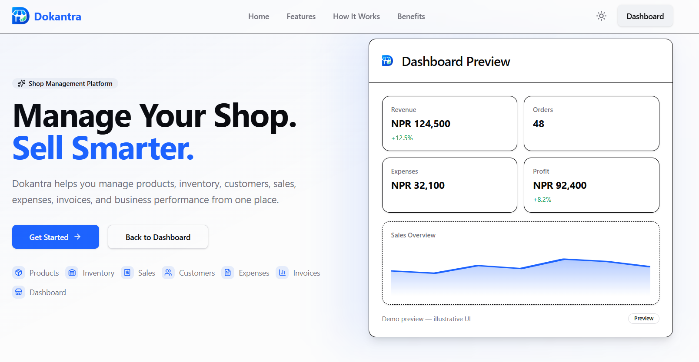
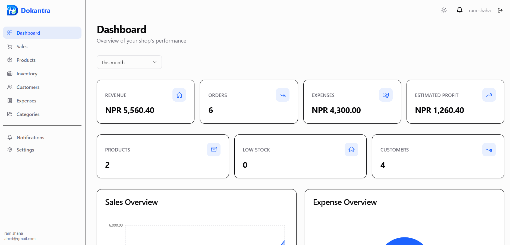



  

# Dokantra

**Run Your Shop Smarter.**

Dokantra is a modern full-stack shop and business management platform designed to help small and medium-sized businesses manage products, inventory, customers, sales, expenses, and business operations from one centralized system.

---

## 🚀 Live Demo

> 🔗 **Live demo:** _[https://dokantra.vercel.app](https://dokantra.vercel.app)_ 

---

## 📸 Screenshots

### 🏠 Homepage

### 📊 Dashboard

---

## Features

### Authentication
- User registration with business creation
- Login and logout
- Short-lived JWT access tokens
- Long-lived refresh tokens stored in HttpOnly cookies
- Refresh-token rotation
- Protected routes
- Authentication state management
- Argon2id password hashing

### Dashboard
- Business overview with key statistics
- Sales, revenue, expenses, and estimated profit metrics
- Low-stock product indicators
- Date range filtering
- Role-aware metric visibility

### Products
- Create, view, update, and deactivate products
- SKU uniqueness enforced per business
- Category assignment
- Stock quantity and low-stock threshold
- Search and filter by category or stock status
- Soft-delete preserves historical sale references

### Categories
- Create, view, update, and deactivate categories
- Duplicate name prevention within a business
- Soft-delete preserves historical references

### Inventory
- Stock tracking per product
- Restock operations with immutable movement records
- Manual stock adjustments with required notes
- Inventory movement history
- Low-stock filtering
- Stock cannot become negative

### Customers
- Create, view, update, and deactivate customers
- Search by name, phone, or email
- Soft-delete preserves historical references
- Walk-in / anonymous customer support via sales

### Sales / POS
- Create sales with multiple items
- Customer selection or walk-in sales
- Server-side price and total calculation
- Automatic stock deduction inside a MongoDB transaction
- Immutable inventory movement records
- Sale cancellation with stock restoration
- Invoice generation (printable)
- PDF invoice export

### Expenses
- Create, view, update, and delete expenses
- Expense categories and date range filtering
- Server-side business context enforcement

### Reports
- Sales trend report
- Expense breakdown by category
- Top-selling products
- Low-stock report
- Customer report with top customers

### Settings
- Profile management
- Business settings
- Currency configuration
- Theme preferences (light / dark)

### Notifications
- In-app notification system
- Notification dropdown with read/unread states

### User Experience
- Responsive design for mobile, tablet, and desktop
- Keyboard accessibility
- Professional toast notifications
- Loading, error, and empty states
- Standardized validation and error messages

---

## Technology Stack

### Frontend
- React, TypeScript, Vite
- React Router, TanStack Query
- Tailwind CSS, shadcn/ui
- Lucide React, Recharts, jsPDF

### Backend
- Node.js, Express, TypeScript
- Mongoose, Zod, Argon2id
- JWT, Helmet, express-rate-limit

### Database
- MongoDB Atlas, Mongoose

### Deployment
- Vercel (frontend), Render (backend), MongoDB Atlas (database)
